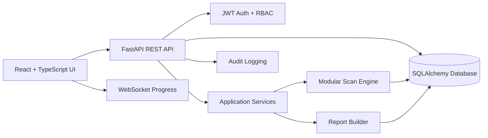

# Architecture

## Backend Layers

- `api/routers`: HTTP and WebSocket endpoints.
- `schemas`: Pydantic request and response contracts.
- `models`: SQLAlchemy persistence models.
- `services`: business logic for audit, target validation, scan orchestration, and reports.
- `core`: configuration, security, and logging.

## Extension Point

Scanner integrations should implement the scan step protocol in `app/services/scan_engine.py`. This allows new scanners to be added without changing frontend API contracts.

